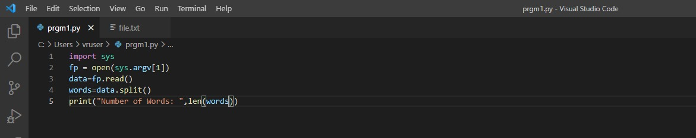
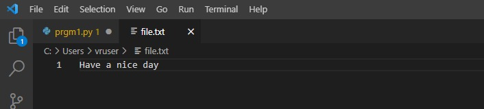
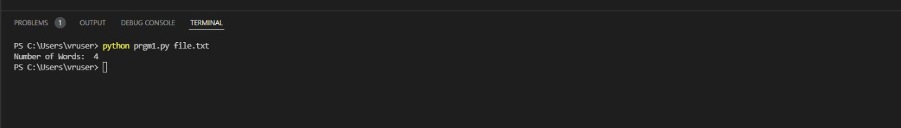

# command-line-arguments-to-count-word
## AIM:
To write a python program for getting the word count from the contents of a file using command line arguments.
## EQUIPEMENT'S REQUIRED: 
PC
Anaconda - Python 3.7
## ALGORITHM: 
### Step 1:
As a first step import sys.
### Step 2: 
 Create a file.txt and add a content.
### Step 3: 
Split the words using .split() function.
### Step 4:  
Read the words.
### Step 5: 
Run the program

## PROGRAM:

### OUTPUT:

## RESULT:
Thus the program is written to find the word count from the contents of a file using command line arguments.
